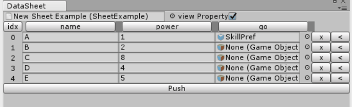
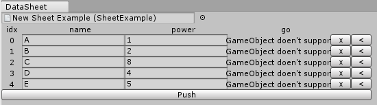
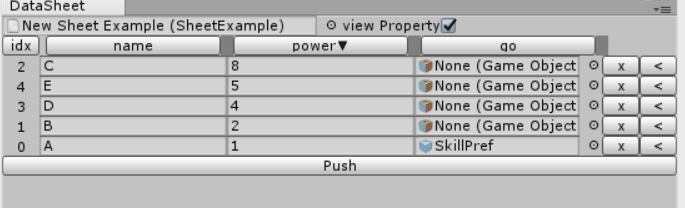

# overview.

--|commercial | free
--|-----------|-----
type|all type| string, float, int
sort colume | O | X
control width | O | X

# type

--|commercial | free
--|-----------|-----
string| O | O
float | O | O
int | O | O
bool | O | X
enum | O | X  
List | O | X
Object | O | X
Vector3| O | X
Vector2| O | X
Color| O | X
Gradient| O | X
AnimationCurve| O | X

# sort colume

## commercial

## free

# control width 

## commercial

## free

