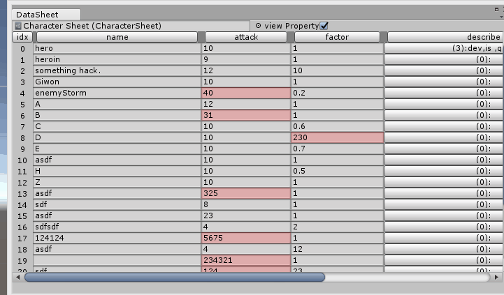

# PatchNode of DataSheetLab

## 1.0 Release.

## 1.1 
implement IEnumerable at Sheet and ReferSheet.

## 1.1a
bugfix of ReferSheet indexer.

## 1.2
fix bottleneck. remove viewcount.

## 1.2a
fix bug with sprite field.

## 1.2b
fix bug with gameObject field.
enable enumtype to check multi item.

## 1.3
add control to change cell width.

enum is now drawn as a mask if each item has 1 bit, or as a normal enumpopup.

