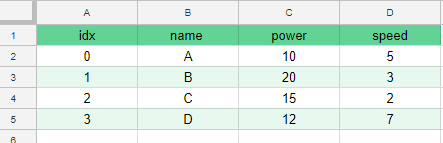
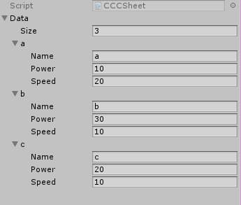
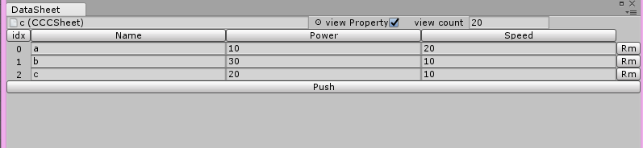
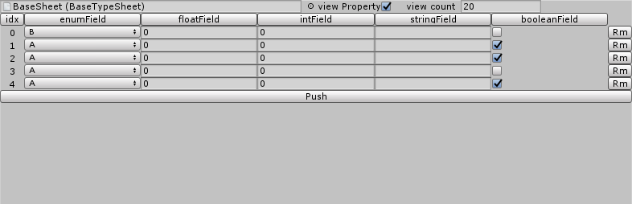
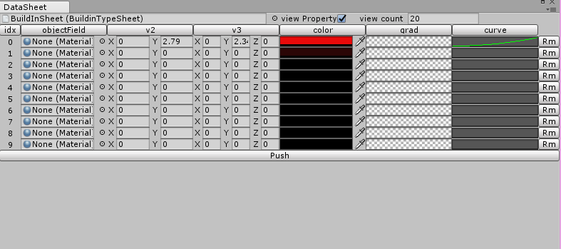
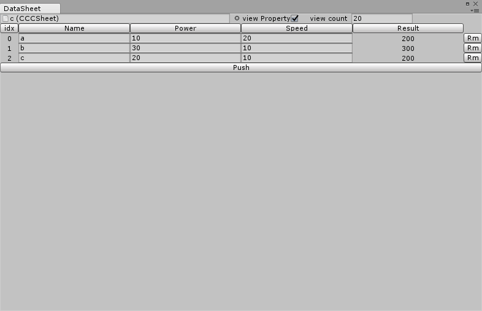
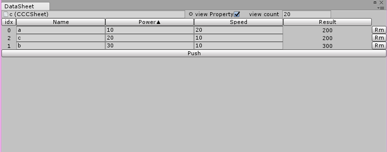
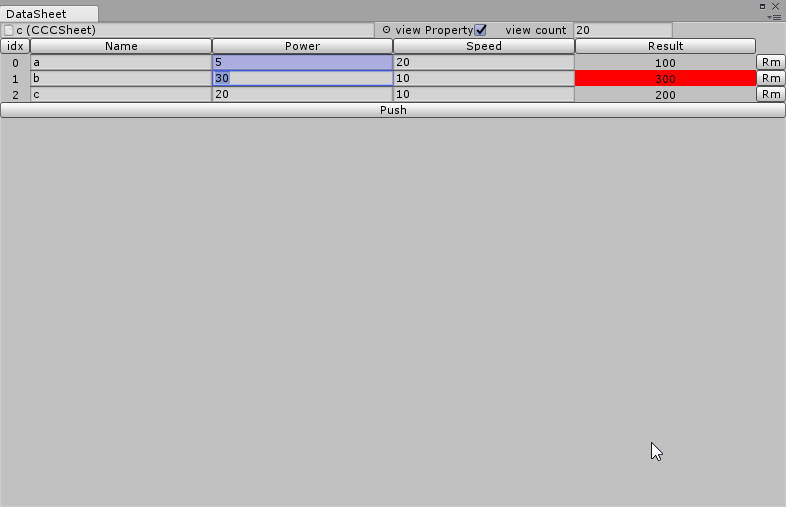
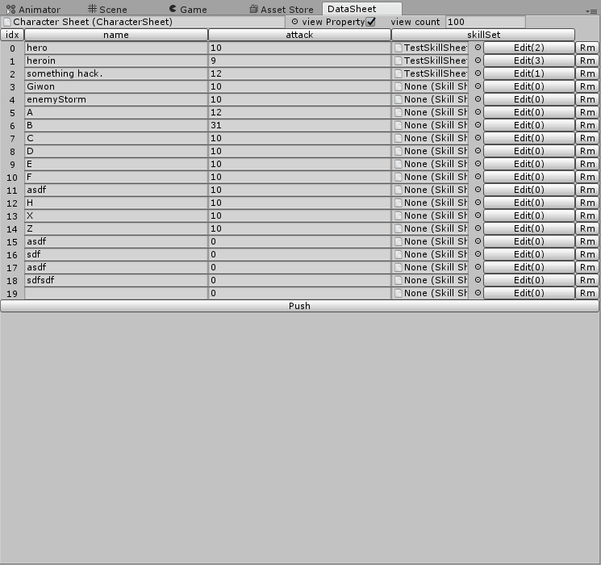

# DataSheetLab-Info
unity3d, assetstore, asset, sheet
이 저장소는 에셋스토어에 등록된 DataSheetLab의 버그리포트와 패치노트 이용가이드 등을 다룹니다.

# 소개
게임개발에 있어서 Sheet는 매우 자주 쓰이는 데이터 저장소 입니다. 엑셀이나 구글스프레드시트를 사용하면
데이터를 한눈에 파악할 수 있고 수치를 판단하기 쉽습니다. 그래서 관련 동기화 에셋들이 에셋스토어에는 많으며
가장 많이 사용되는 것으로 추측됩니다. 

하지만 이 방식에는 다음과 같은 문제점이 있습니다. 

- string과 number(float,int)로 다룰 수 있는 타입이 제한됩니다.
- 외부툴을 사용하기 때문에 개발플로우가 복잡해집니다.
 

 
 위 시트데이터를 처리한다고 하면 개발자는 해당하는 시트의 데이터를 받아와 처리할 클래스를 정의해야 합니다
```csharp
public class Character{
  public string Name;
  public int power;
  public int speed;
}
```
열(Column)추가하거나 삭제해야할 때 관련된 추가 작업이 생기게 됩니다. 테스트 또한 새로 작성해야 하는등 하나의 데이터
필드를 지우거나 수정했을 뿐인데 도미노처럼 일이 생깁니다. DataSet을 사용하면 할일이 조금 줄어들긴 하지만 사용하는 측에선
다소 불편함이 생깁니다. 이 과정을 줄이고 동기화를 해주는 에셋을 사용하면 다소 편해지기는 합니다. 하지만 본질적으로
할일이 없어지진 않습니다. 

여기서 DataSheetLab을 소개합니다. 사실 이 에셋은 List<CustomClass>를 하나 가진 ScriptableObject를 사용하는 것과 본질적으로는 다르지 않습니다.
다만 이러한 데이터를 그냥 사용하면 기획자나 다른 사람들이 보기에는 불편하며 어렵습니다. DataSheetLab은 이러한 데이터를
Sheet를 사용하는 것 처럼 관리하고 편집할 수 있게 도와줍니다.

  
# 사용자가이드

## 생성
 위에서 보인예제로 시작하겠습니다. 일단 에셋을 구입하면 구현된 Example예제가 있습니다.
여기서는 처음부터 차례차례 사용법을 보여드립니다. 위에서 Character에 대한 Sheet를 만들려면 다음과 같이 코딩합니다.
```csharp
[System.Serializable]
public class Character {
  public string name;
  public int power;
  public int speed;
}
[CreateAssetMenu]
public class CCCSheet : Sheet<Character> { }
///it same as
// public class CCCSheet : ScriptableObject{
//    public List<Character> Data;
// }

```
 이 코드가 시트를 사용하기 위한 코드의 전부입니다. 자동으로 새로 추가된 Assets/Create/CCCSheet
새로운 시트를 생성합니다. 다시말씀드리지만 이건 다음 asset파일과 동일합니다. ingame에서는 따로 코드가 필요하지
않을 정도로 단순합니다.



하지만 Sheet를 상속받음으로써 DataSheetEditor에서 식별이 가능합니다. 이제 Window/DataSheetEditor를 선택하여 엽니다.
새로만든 CharacterSheet를 선택하면 위 asset파일을 다음과 같이 볼 수 있습니다.



여기서 해당하는 값을 편집하면 곧바로 값이 바뀌며 데이터의 추가, 삭제가 쉽습니다.

## 타입

 단순히 문자열과 숫자뿐만 아니라 Unity에서 제공하는 모든 타입을 지원합니다. 다음과 같이 Sheet를 선언해봅시다.
```csharp
public enum EABC
{
    A,B,C
}

[Serializable]
public class BaseTypeData
{
    public EABC enumField;
    public float floatField;
    public int intField;
    public string stringField;
    public bool booleanField;
}

[CreateAssetMenu]
public class BaseTypeSheet : Sheet<BaseTypeData> { }
```
위 시트는 DataSheetEditor에서 다음과 같이 표시됩니다.



유니티에서는 다양한 추가 타입이 존재합니다. 대표적으로 Vector3가 있죠.
관련된 타입을 작성해 봅시다.
```csharp
[Serializable]
public class BuildinTypeData
{
    public Material objectField;
    public Vector2 v2;
    public Vector3 v3;

    public Color color;
    public Gradient grad;
    public AnimationCurve curve;
}

[CreateAssetMenu]
public class BuildinTypeSheet : Sheet<BuildinTypeData> { }
```

이 시트는 다음과 같이 표시됩니다.


## 정렬

 만약 숫자나 문자열등 비교할 수가 있다면 열정렬이 가능합니다. 맨처음 언급한 CCCSheet를 보겠습니다.


여기서 Power부분을 클릭해봅시다.



Power가 Power ▲ 로 바뀌면서 오른차순으로 바뀝니다. 다시 누르면 내림차순으로 정렬됩니다.
데이터 순서자체는 옆의 idx를 보면 알 수 있듯이 그대로 있습니다.


## 프로퍼티

 이 기능은 Sheet의 수식을 따라하려고 만든 것입니다. CCCSheet에 다음과 같이 프로퍼티를 추가해봅시다.

```csharp
[Serializable]
public class Character
{
    public string Name;
    public int Power;
    public int Speed;

    public int Result
    {
        get
        {
            return Power * Speed;
        }
    }
}
```

이렇게 선언하면 시트에서 다음과 같이 표시됩니다.



Result는 Power와 Speed를 단순 곱한 값입니다. 이 값은 수정이 불가능 하지만 필드처럼 정렬이 가능합니다.

## 조건부 색상

 엑셀이나 구글스프레드시트에 조건부서식이란 기능이 있습니다. 이 기능을 단순화 시켜서 구현한 기능합니다.
CharacterClass에 다음과 같은 속성을 추가합니다.

```csharp
[Serializable]
public class Character
{
    public string Name;
    [SmallCheck(20)]
    public int Power;
    public int Speed;
    [BigCheck(250)][SmallCheck(100)]
    public int Result
    {
        get
        {
            return Power * Speed;
        }
    }
}
```
 float이나 int 맴버에 대하여 속성을 추가할 수 있습니다. 이렇게 추가하면 다음과 같이 동작합니다.
 


직관적으로 어떻게 동작하는지 알 수 있으길것 같습니다.

BigCheck와 SmallCheck 모두 각각 다음과 같이 색상을 설정할 수 있습니다.

```
//defulat color is Red
[BigCheck(100, 1, 1, 1)] max, r, g, b 

//default color is Blue
[SmallCheck(100, 1, 1, 1)] min, r, g, b
```


## 사용법

 ScriptableObject를 사용하는 것과 동일하게 사용하면 됩니다. 여기서는 심플한 예제를 다룹니다.
 
 ```csharp
 
public class CharacterManager : MonoBehaviour {
  public CCCSheet characterSheet;
  
  public void Start(){
    foreach(var character in characterSheet){
      Debug.Log(character.name)
    }  
}
  
public void CreateCharacter(int idx){
    var c = characterSheet[idx];
} 
 ```

위와같이 선언한 CharacterManager에서 CCCSheet에 작성한 Sheet를 넣으면 됩니다.

## ReferSheet

 이렇게 사용하다 보면 가끔 다른 시트의 아이템을 참조하는게 필요할 때가 있습니다.
CharacterSheet와 SkillSheet가 있다고 가정합니다. 캐릭터는 다양한 스킬이 있을 수 있고
SkillSheet의 수많은 아이템들중 2번째 4번째 같은 특정한 아이템들을 참조해야 할 경우가 있습니다. 
ReferSheet는 DataSheetEditor에서 다른 Sheet의 아이템을 쉽게 참조할 수 있게 도와줍니다.

SkillSheet를 선언할때 다음과 같이 ReferSheet를 선언합니다.
```csharp
[Serializable]
public class SkillData
{
    public string Name;
    public float Factor;
    public AnimationCurve curve;
    public Color color;
}

[CreateAssetMenu]
public class SkillSheet : Sheet<SkillData> { }

[Serializable]
public class SkillRefer : ReferSheet<SkillSheet, SkillData> { }
```


참조할 곳에서는 SkillRefer로 필드선언을 하면 됩니다.

```csharp
public class Character {
   ...
   
   SkillRefer skills;

   ...
}
```

DataSheetEditor에서는 다음과 같이 사용합니다.

1. 일단 참조할 Sheet를 선택합니다.
2. Edit버튼을 누릅니다.
3. count를 0보다 큰값으로 바꿉니다.
4. 인덱스를 설정합니다.

만약 해당하는 아이템이 string필드가 있다면 자동으로 그 값을 표시하여 어떤 아이템을 참조하고 있는지 알려줍니다. 동작은
다음과 같습니다.




