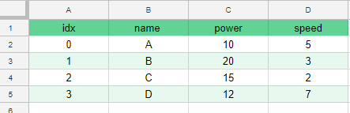
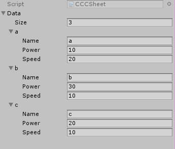
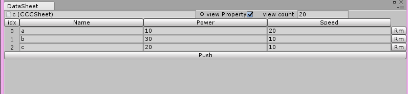
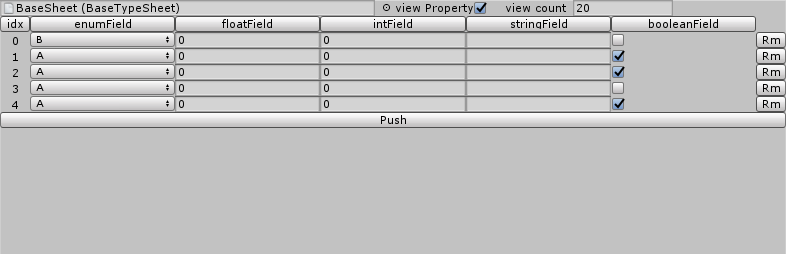
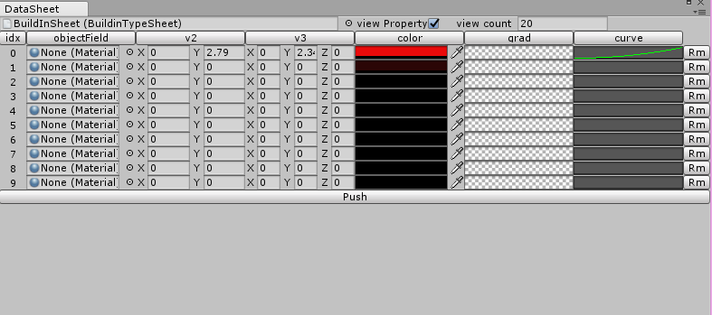
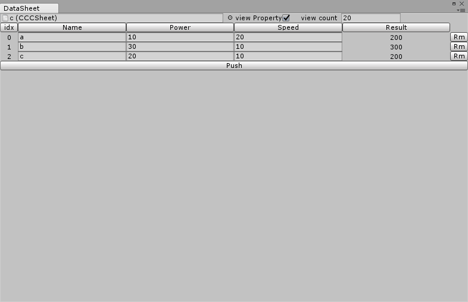
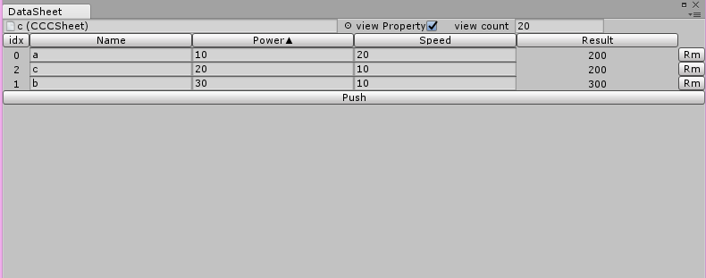
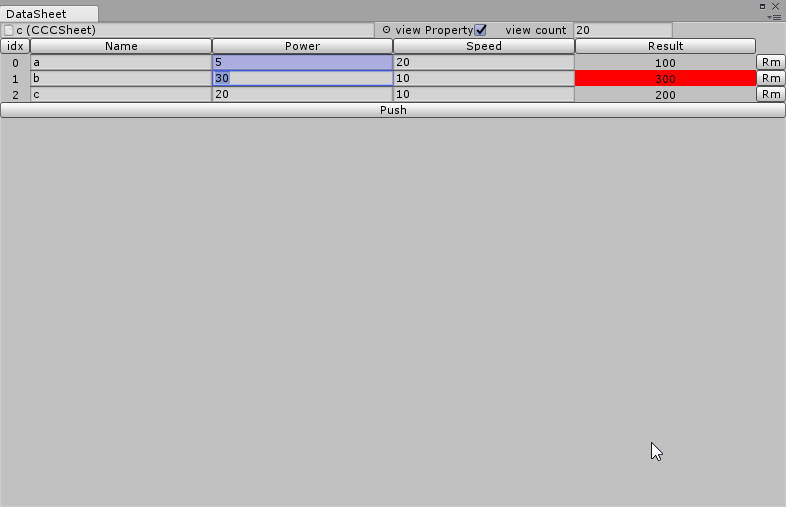
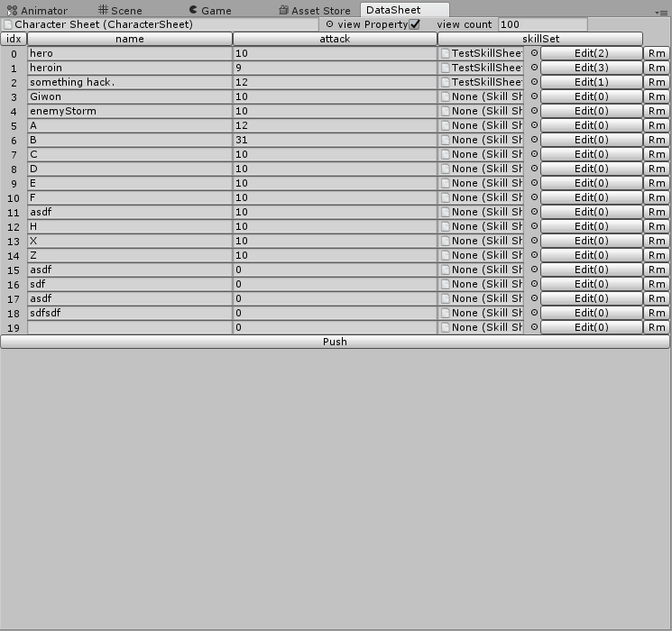

# DataSheetLab-Info
unity3d, assetstore, asset, sheet

This repository covers bug reports, guide and patchnote from the [DataSheetLab](https://www.assetstore.unity3d.com/en/#!/content/118157) registered in the Asset Store. __Not source code or package.__

[Commercial Version](https://www.assetstore.unity3d.com/en/#!/content/118157)


[Free Version](https://www.assetstore.unity3d.com/en/#!/content/117965)

[PatchNote](PatchNote.md) 

[한글 가이드](document(korean).md)

# Introduce
In game development, Sheet is a very common data store. With Excel or Google spreadsheets,
It is easy to grasp the data at a glance and to judge the numerical value. So there are a lot of related sync assets in the asset store

However, this method has the following problems.

- Only can use number and string.
- The development flow is complicated by the use of external tools.
 

 
For example, suppose you want to process the sheet data above, and the developer needs to define the class to receive and process the sheet data

```csharp
public class Character{
  public string Name;
  public int power;
  public int speed;
}
```

Imagine if you insert a new sheet of data. You must define a new class, and you must also create a new serialization.
This is a very troublesome task.

Here is an introduction to DataSheetLab. In fact, this asset is essentially same as using a ScriptableObject with one List <CustomClass>.
DataSheetLab helps you edit and manage these ListData like a Sheet.
  
# Guide

## Make sheet
Let's start with the example shown above.
Here we show you how to use it from the beginning. To create a Sheet for Character above, code as follows:
```csharp

// need [Serializable]
[System.Serializable]
public class Character {
  public string name;
  public int power;
  public int speed;
}

// the sheet class name must be same as the file name.
[CreateAssetMenu]
public class CCCSheet : Sheet<Character> { }
///it same as
// public class CCCSheet : ScriptableObject{
//    public List<Character> Data;
// }

```

This code is all the code to use the sheet. With the newly added [Assets / Create / CCCSheet]
Create a new sheet. Again, this is the same as the following asset file.



However, by inheriting Sheet, it can be identified in the DataSheetEditor. Now select and open Window / DataSheetEditor.
If you select CharacterSheet above, you can see the following.



If you edit the corresponding value, the value will be changed immediately and it is easy to add and delete data.

## Types

It supports all types provided by Unity as well as simply strings and numbers. Let's declare Sheet as follows.
```csharp
public enum EABC
{
    A,B,C
}

[Serializable]
public class BaseTypeData
{
    public EABC enumField;
    public float floatField;
    public int intField;
    public string stringField;
    public bool booleanField;
}

[CreateAssetMenu]
public class BaseTypeSheet : Sheet<BaseTypeData> { }
```
The above sheet is displayed in DataSheetEditor as follows.



There are many additional types in Unity. Typically we have Vector3.
Let's create a these type.
```csharp
[Serializable]
public class BuildinTypeData
{
    public Material objectField;
    public Vector2 v2;
    public Vector3 v3;

    public Color color;
    public Gradient grad;
    public AnimationCurve curve;
}

[CreateAssetMenu]
public class BuildinTypeSheet : Sheet<BuildinTypeData> { }
```

This sheet will look like this:


### Enum
If you want to declare a multi-checkable enum, you must define an enum as follows
```csharp
public enum EMask{
    A = 1,
    B = 2,
    C = 4,
    D = 8,
    E = 16
}

public enum ESingle{
   A,B,C,D,E
}
```

If each item has 1 bit, it will automatically drawn using enumMask.


## sort in column

If the column is a comparable member such as a number or a string, column sort is possible. Let's look at the first mentioned CCCSheet.


Let's click on the top Power button.



Power changes to Power ▲, and it changes in ascending order. Press again to sort in descending order.
The data sequence itself remains as you can see from the idx side.


## Property view

This feature was created to follow the formula in Sheet. Let's add the following property to Character class.

```csharp
[Serializable]
public class Character
{
    public string Name;
    public int Power;
    public int Speed;

    public int Result
    {
        get
        {
            return Power * Speed;
        }
    }
}
```

When you declare it like this, you will see something like this on the sheet:



Result is simply multiplied power and speed. This value is not editable, but it is sortable like a field.

## conditional color.

Excel or Google spreadsheets have the function of conditional formatting. This function is simplified and implemented.
Add the following attribute to the CharacterClass:

```csharp
[Serializable]
public class Character
{
    public string Name;
    [SmallCheck(20)]
    public int Power;
    public int Speed;
    [BigCheck(250)][SmallCheck(100)]
    public int Result
    {
        get
        {
            return Power * Speed;
        }
    }
}
```
 You can add attributes for float or int members. This adds the following behavior:
  


Intuitively, you can see how it works.

For both BigCheck and SmallCheck, you can set the value and the color as follows:

```
//defulat color is Red
[BigCheck(100, 1, 0, 0)] max, r, g, b 
//if valus is high than 100 set color red.

//default color is Blue
[SmallCheck(100, 0, 0, 1)] min, r, g, b
//if value < 100 than set color blue.
```


## Ingame

You can do just as you would use a ScriptableObject. Here is a simple example.

 ```csharp
 
public class CharacterManager : MonoBehaviour {
  public CCCSheet characterSheet;
  
  public void Start(){
  ///If you want all references, use foreach.
    foreach(var character in characterSheet){
      Debug.Log(character.name)
    }  
}
  
public void CreateCharacter(int idx){
  ///If you want to reference an item, use the indexer.
    var c = characterSheet[idx];
} 
 ```

In the CharacterManager declared above, setup the sheet created.

## ReferSheet

When you create a game centered on a sheet, you may want to refer to an item on another sheet.
For example, suppose you have a CharacterSheet and a SkillSheet. A character can have various skills.
You may need to refer to specific items such as the second and fourth of the many items on the SkillSheet.
ReferSheet allows you to easily refer to items in other sheets in the DataSheetEditor.

When declaring a SkillSheet, declare a ReferSheet too as follows:

```csharp
[Serializable]
public class SkillData
{
    public string Name;
    public float Factor;
    public AnimationCurve curve;
    public Color color;
}

[CreateAssetMenu]
public class SkillSheet : Sheet<SkillData> { }

[Serializable]
public class SkillRefer : ReferSheet<SkillSheet, SkillData> { }
```


For reference, you can declare the field as SkillRefer.

```csharp
public class Character {
   ...
   
   SkillRefer skills;

   ...
}
```

In the DataSheetEditor:

1. Select the sheet you want to reference.
2. Click the Edit button.
3. Replace count with a value greater than 0.
4. Set the index.

If the corresponding item has a string field, it automatically displays its value to indicate which item it is referring to. Operation
It is as follows.




## Ingame referSheet 

It is similar to referring to Sheet.
If you want to follow all items, use Foreach
If you need one item, you can use an indexer.

```csharp
//use foreach reference all item.
foreach (var skill in sheet[idx].skillSet)
{
   ... ///skill is item in skillSheet.
}
//if reference single item 
var sk0 = sheet[idx].skillSet[0];
```
